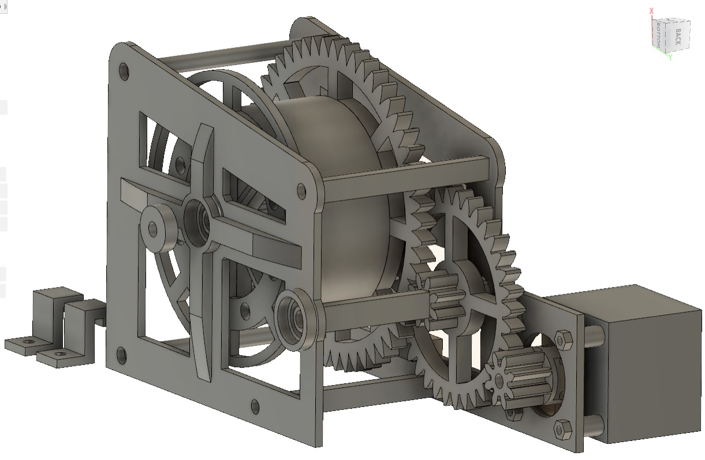

# Cтанок по вытяжке прутка на основе разработок Виталия Богачева.

Простое, функциональное устройство для переработки бутылок в филамента.  

Обзорное видео тут: https://youtu.be/G16bqoB8Z38

Схема устройства - [schema](pdf/2019-11-28V1.2.pdf)
Печатная плата для ЛУТ - https://drive.google.com/open?id=1dySD1lTDA4rSZQcVADHj6VBQWqIWLeg4

