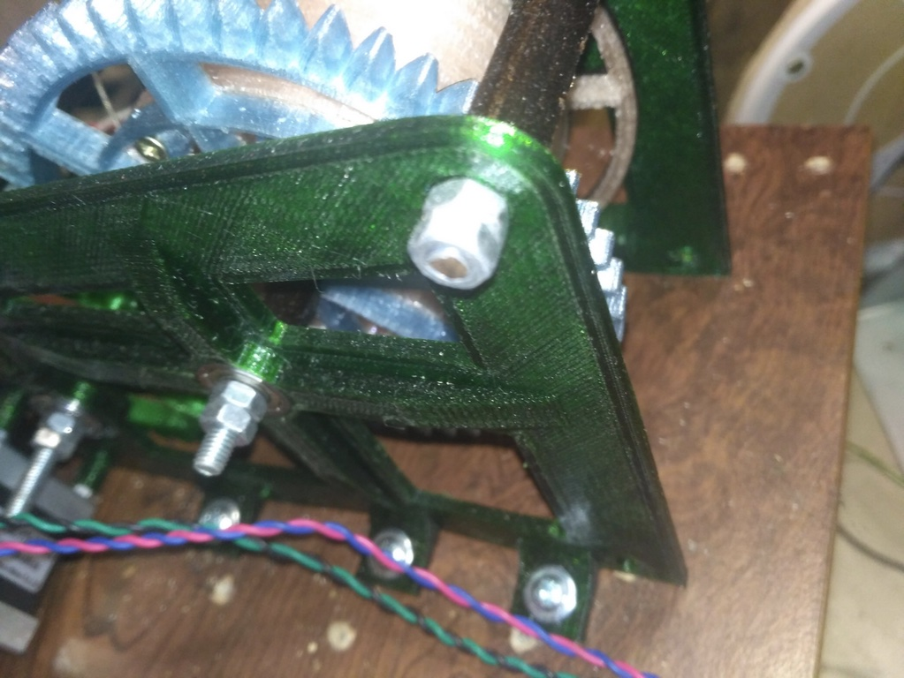

# Cтанок по вытяжке прутка на основе разработок Виталия Богачева.

Простое, функциональное устройство для переработки бутылок в филамента.  

- [Обзорное видео тут](https://youtu.be/G16bqoB8Z38)
- [Схема устройства](pdf/2019-11-28V1.2.pdf)
- [Печатная плата для ЛУТ](https://drive.google.com/open?id=1dySD1lTDA4rSZQcVADHj6VBQWqIWLeg4)

## Материалы

- Двигатель - Nema 17
- Контроллер - Arduino Nano V3 
- Драйвер - A49888
- Дисплей - LCD 1602 (HD44780)
- Термистор - 100К от 3D принтера
- Нагреватель - 12V*40ВТ от 3D принтера 
- Блок нагревателя -  E3D Volcano от 3D принтера
- Сопло - 0,8мм диаметром для принтера Anet A6
- Металлический уголок из строительного магазина 
- Подшипники - 625ZZ (опционально)

Маленькие саморезы для сборки составной детали бобины  и большие для крепления станка к основанию. 

## Характеристики 

- Энергопотребление - менее 40Вт*ч
- Скорость производства филамента ~ 10-20 см/мин
- Диаметр прутка - 1,7мм^2
- Заполнение прутка ~ 60-80%
- Рабочая температура ~ 160

## Сборка

Для сборки станка понадобится длинная шпилька с резьбой из строительного магазина диаметром 5мм. 
Её отрезками скрепляются две половинки станка, с установленными между ними шестернями.

