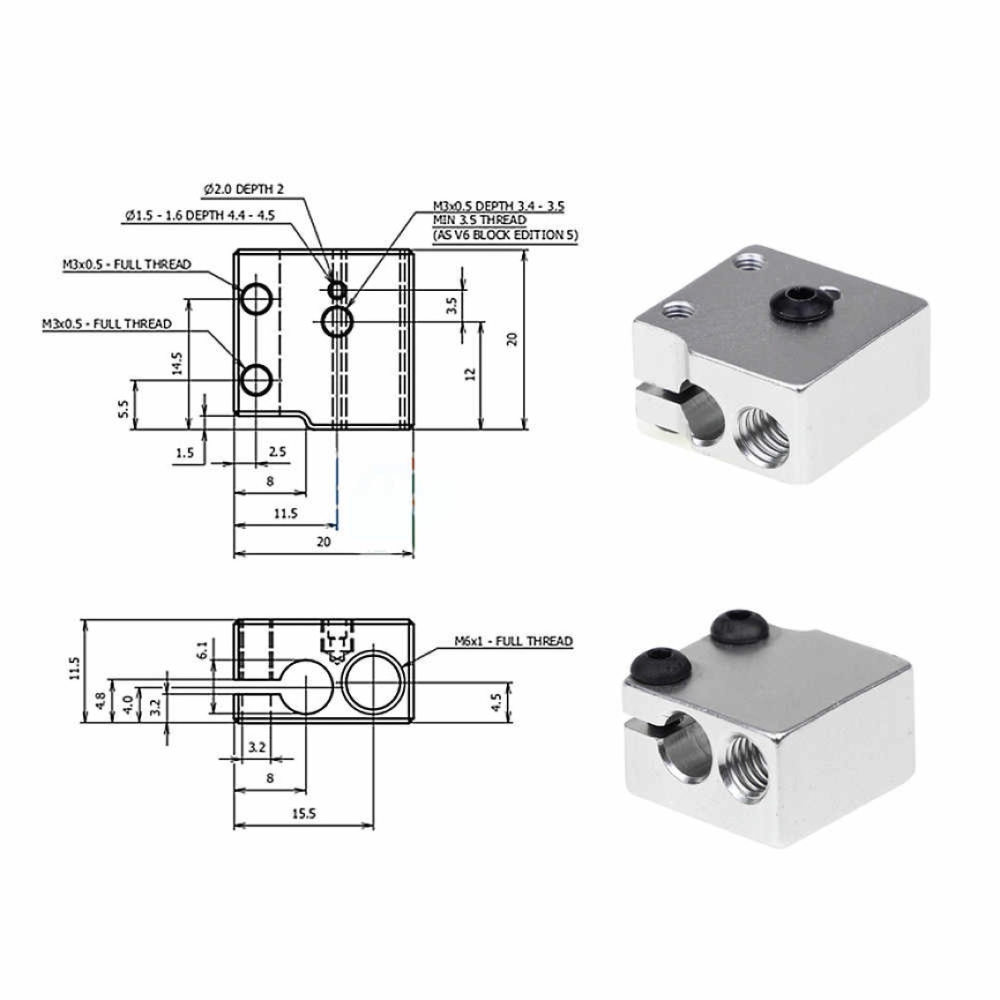
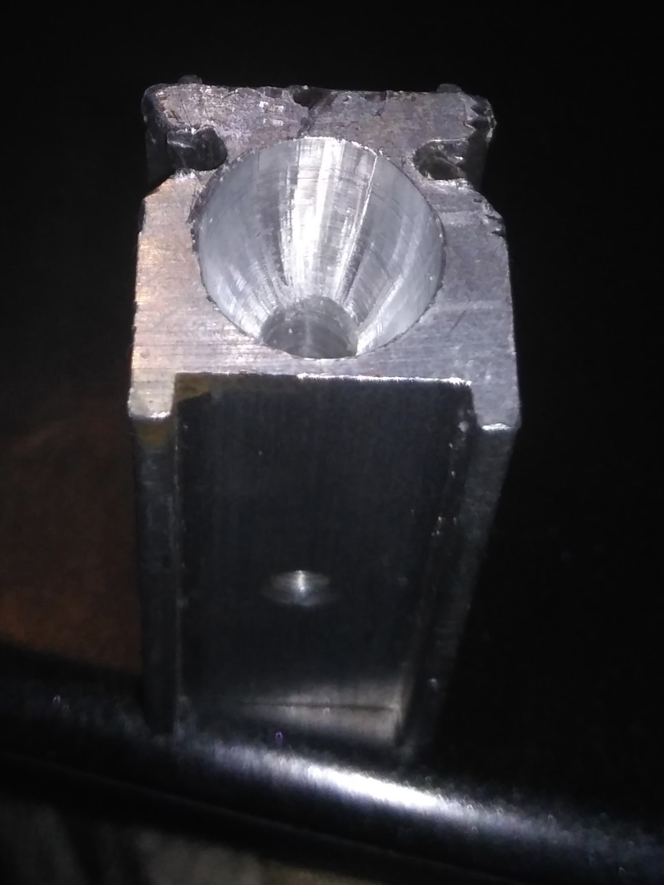
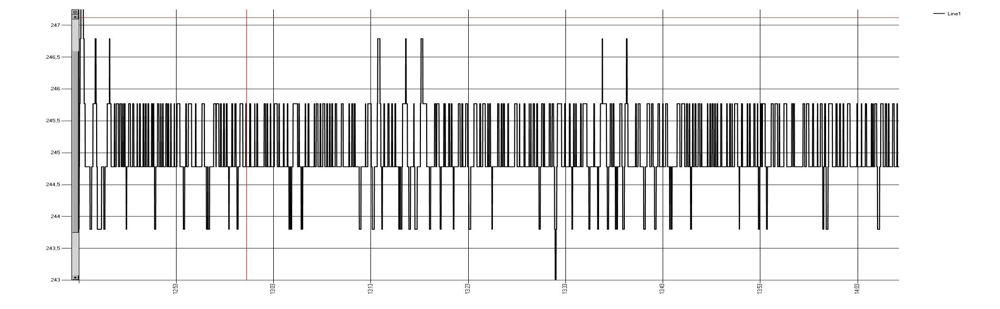
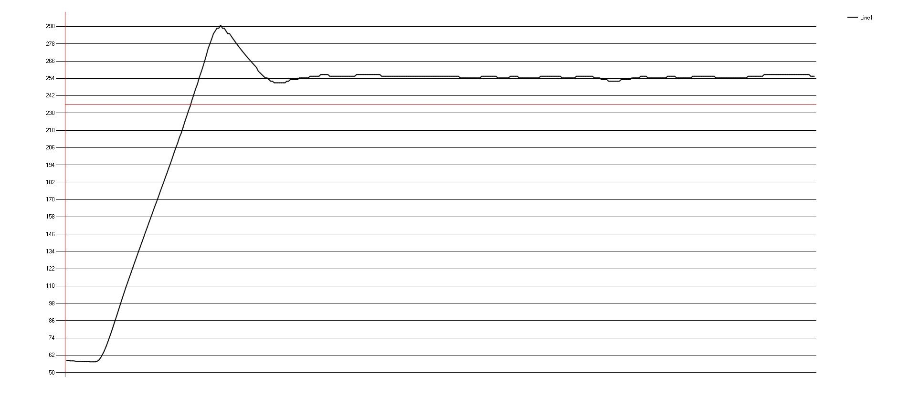

# Cтанок по вытяжке прутка на основе разработок Виталия Богачева.


Простое, функциональное устройство для переработки бутылок в филамента.  

- [Обзорное видео тут](https://youtu.be/G16bqoB8Z38)
- [Схема устройства](pdf/2019-11-28V1.2.pdf)
- [Печатная плата для ЛУТ](https://drive.google.com/open?id=1dySD1lTDA4rSZQcVADHj6VBQWqIWLeg4)

## Материалы

- Двигатель - Nema 17
- Контроллер - Arduino Nano V3 
- Драйвер - A49888
- Дисплей - LCD 1602 (HD44780)
- Термистор - 100К от 3D принтера
- Нагреватель - 12V*40ВТ от 3D принтера 
- Блок нагревателя -  E3D Volcano от 3D принтера
- Сопло - 0,8мм диаметром для принтера Anet A6
- Металлический уголок из строительного магазина 
- Подшипники - 625ZZ (опционально)

Маленькие саморезы для сборки составной детали бобины  и большие для крепления станка к основанию. 

## Характеристики 

- Энергопотребление - менее 40Вт*ч
- Скорость производства филамента ~ 10-20 см/мин
- Диаметр прутка - 1,7мм^2
- Заполнение прутка ~ 60-80%
- Рабочая температура ~ 160

## Сборка

Для сборки станка понадобится длинная шпилька с резьбой из строительного магазина диаметром 5мм. 
Её отрезками скрепляются две половинки станка, с установленными между ними шестернями.


Стенки станка распечатывается любым видом пластика.  
Шестерни из PET более подходят для работы нежели из ABS.  
Валы шестерен крепятся к корпусу через подшипники 625ZZ. 


За сто рублей в Китае можно купить 10 штук. Если подшипников нет в наличии - можно временно распечатать из пластика втулки. Они включены в проект. Изготовленные из бутылочного PET - они работают достаточно хорошо и особенного износа (даже работая по резьбе шпилек) у них я не заметил.  

## Сопло экструдера.

В моем случае было использовано сопло изготовленное из болта с диаметром резьбовой части - 5 мм.


Он был обрезан до общей длины ~10мм. Затем в центре было просверлено отверстие диаметром 2мм. Такой диаметр слишком большой для производства филамента, поэтому для его уменьшения был использован шарик от шарикоподшипника.  Несколько ударов молотка по шарику установленному на выходном отверстии экструдера - и его диаметр сужается до необходимых 1,7мм. 

У меня также был опыт использования в качестве экструдера штатных сопел устанавливаемых в принтер Anet A6. Но после нескольких неудачных попыток протяжки филамента - я отложил их до лучших времен. 
03,12,2019 - UPD 
Вполне неплохо показали себя рассверленые родные длииинные сопла для нагревателя вулкан.  
22,12,2019 - UPD

Сейчас делаю так. Беру болт М6 с длиной резьбовой части 10мм(накручиваем 2 гайки и отрезаем ножовкой). Затем подбираю сверло по фактическому диаметру 1,7мм и просверливаю болт насквозь. Затем раздаю перьевыми сверлами по кафелю. 


## Нагреватель

Изготавливается путем высверливания конического отверстия в блоке Volcano



с помощью перьевого сверла по кафелю, диаметром 8мм.



Высверливание продолжается до тех пор пока кончик сверла не коснется латунной поверхности сопла. Контроль ведется визуально. 
Для крепления блока нагревателя к рабочему столу станка - используется обычный металлический строительный уголок. В нем просверливаются пару отверстий под штатные винты, зажимающие керамический ТЭН. 


Никакой теплоизоляции не используется. PID регулятор контроллера держит температуру в заданных пределах очень точно, компенсируя теплопотери. Ниже посекундный график, показывающий дрейф температуры в пределах нескольких разрядов АЦП на протяжении часа реальной работы станка. 

вот так выглядит общая работа ПИД регулятора. 




## Температура. 
Вопреки оригинальному видео Виталия - я выяснил что температура 250-260С избыточна для производства филамента. В помещении начинает нещадно вонять, как на промзоне Парнас в Питере. При 160 градусах протяжка проходит ровно точно так же, но пластик почти ничем не пахнет.  Работоспособность станка сохраняется и при снижении температуры до 140С, но диаметр прутка начинает плавать. Видимо это не совсем подходящий режим волочения.  

## Бобина для намотки филамента


Эта деталь состоит из трех составных частей.  
Шестерня - передает крутящий момент на тело бобины. Ее зубья испытывают максимальные усилия при протяжке прутка. Ее желательно изготавливать из износостойкого пластика типа PET, PETG или нейлона. В результате протяжки сотни метров прутка одна (рабочая) плоскость зубьев шестерни из ABS примялась, но можно с уверенностью сказать, что полкилометра - километр она протянула бы. Шестерня из PET при том же пробеге не имеет видимых деформаций. 
Тело бобины - деталь на которую наматывается пруток. Общая нагрузка - средняя. Можно печатать из любого типа пластика. 
Крышка бобины - деталь испытывающая нагрузки только когда к ней подходит навиваемый пруток. Очередной виток пытается втиснуться между предыдущим и крышкой бобины. Тем самым пытается оторвать крышку от тела бобины. 
Этому должны помешать восемь маленьких саморезов которыми крепится крышка к телу бобины. В первом прототипе было всего два самореза и их вырвало без особого труда.  С восемью саморезами проблем не возникало. Печатать крышку можно любым типом пластика. 

## Контроллер скорости протяжки и температуры

Изготовлен на основе платки Arduino Nano V3.  Схема простейшая, не имеет дефицитных деталей, простая для повторения.  
Печатная плата выложена в репозитории. Хоть и полностью функциональная - пока не совсем готова для корпусирования. Опыта в этом у меня не много. Потому получается не с первого раза.


Установки температуры и скорости протяжки запоминаются. Планируется дописать подсчет произведенных метров филамента. Оптимизировать режимы протяжки. 
Работа контроллера очень стабильна. При сборке я специально не использовал фильтрующие конденсаторы по питанию. Несмотря на это плата управления ни разу не сбоила. Если даже в таком режиме ничего не идет в разнос, то после установки емкостей по питанию - все будет совсем железобетонно. 
В рабочем режиме звука двигателя почти не слышно. 

## Прошивка 
Прошивка как всегда простейшая. Включает в себя три шага. 
1) Скачивание последней прошивки из репозитория: 

- https://drive.google.com/open?id=1S7iesOyFmSDcyv66gEf9Ux55c0caf5wk
- [Скачивание программы которая умеет прошивать ардуино бинарными файлами](https://drive.google.com/open?id=1HEsLZSfcgszGMGvXLtFU6XibcUySJIrJ)
- [Описание программы](http://www.getchip.net/posts/136-gc-uploader-avtomaticheskijj-zagruzchik-hex-fajjlov-dlya-arduino/)

2) Подготовка EEPROM микроконтроллера. 
Желательная процедура для гарантированной очистки содержимого энергонезависимой памяти и исключения возможных ошибок при дальнейшем обновлении прошивки. В большинстве случаев не требуется, но настоятельно рекомендуется. Дело в том что в ПЗУ процессора могут остаться старые данные с которыми станок будет работать не корректно. Для того чтобы их удалить загрузите в ардуину скетч. 

```
#include <EEPROM.h>
void setup() { for (int i = 0 ; i < 512 ; i++) {EEPROM.write(i, 255);}}
void loop() {}
```
После того как прошили им ардуино - подождите 10 секунд и прошивайте основное ПО.

3) Прошивка основного ПО 
Запускаем программу gcUploader для заливки бинарных файлов.HEX в Ардуино.


Подключаем ардуино к компьютеру.  
- Кликаем шестеренку в запустившемся окне программы. 
- Если Вы меняли загрузчик на UNO указываем тип платы - UNO!!!
- Если у Вас новая плата указываем тип платы - NANO!!!
- Проверяем правильность порта подключения Ардуино(если не тот - меняем на актуальный). 
- Перетаскиваем скачанный файл основной прошивки на окно программы. 


И нажимаем пиктограмку с двенадцатиногой микросхемой для старта заливки ПО.
Все! Можно пользоваться! 

Рассматриваются варианты рассылки готовых силовых плат, после доводки до финального состояния.

## Минусы технологии

### Пруток короткий.
Прутки из бутылок получаются относительно короткими - 8-20 метров. Для печати большинства небольших деталей этого достаточно, но все же удобнее когда перед началом печати у Вас хотя бы сотня гарантированных метров пластика на катушке. 
Проблему может решить сварочный аппарат для прутков и я позже его продемонстрирую. В контроллере станка для него все предусмотрено.    
Пруток прямой и жесткий 
Норовит размотаться с катушки. Решить можно либо фиксацией свободного хода катушки, либо свиванием прутка при производстве. Пока не думал над этим. 
### Не пруток, а трубка
Думаю если сообщество подключится к вопросу - сможем обеспечить более плотное прессование ленты в прутке. Тут нужно экспериментировать. 
### Толщина ленты разнится от бутылки к бутылке
А следовательно пруток имеет разное заполнение и нужно как-то нормировать скорость подачи пластика. Пока не думал над этим. но думаю решаемо.
### Медленная скорость печати. 
Похоже особенность всего PET пластика.
