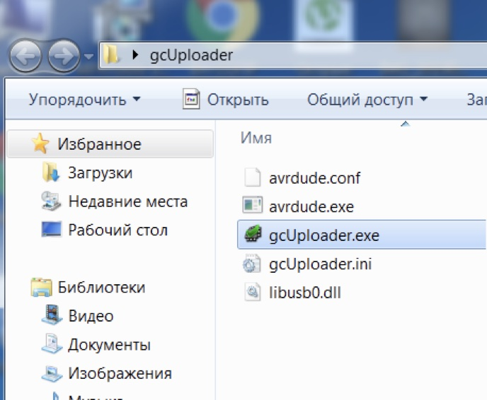
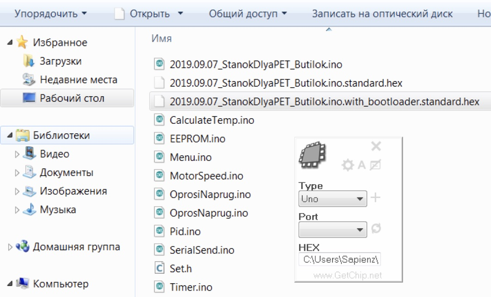

# Контроллер скорости протяжки и температуры

Изготовлен на основе платки Arduino Nano V3.  Схема простейшая, не имеет дефицитных деталей, простая для повторения.  
Печатная плата выложена в репозитории. Хоть и полностью функциональная - пока не совсем готова для корпусирования. Опыта в этом у меня не много. Потому получается не с первого раза.


Установки температуры и скорости протяжки запоминаются. Планируется дописать подсчет произведенных метров филамента. Оптимизировать режимы протяжки. 
Работа контроллера очень стабильна. При сборке я специально не использовал фильтрующие конденсаторы по питанию. Несмотря на это плата управления ни разу не сбоила. Если даже в таком режиме ничего не идет в разнос, то после установки емкостей по питанию - все будет совсем железобетонно. 
В рабочем режиме звука двигателя почти не слышно. 

## Прошивка 
Прошивка как всегда простейшая. Включает в себя три шага. 
1) Скачивание последней прошивки из репозитория: 

- https://drive.google.com/open?id=1S7iesOyFmSDcyv66gEf9Ux55c0caf5wk
- [Скачивание программы которая умеет прошивать ардуино бинарными файлами](https://drive.google.com/open?id=1HEsLZSfcgszGMGvXLtFU6XibcUySJIrJ)
- [Описание программы](http://www.getchip.net/posts/136-gc-uploader-avtomaticheskijj-zagruzchik-hex-fajjlov-dlya-arduino/)

2) Подготовка EEPROM микроконтроллера. 
Желательная процедура для гарантированной очистки содержимого энергонезависимой памяти и исключения возможных ошибок при дальнейшем обновлении прошивки. В большинстве случаев не требуется, но настоятельно рекомендуется. Дело в том что в ПЗУ процессора могут остаться старые данные с которыми станок будет работать не корректно. Для того чтобы их удалить загрузите в ардуину скетч. 

```
#include <EEPROM.h>
void setup() { for (int i = 0 ; i < 512 ; i++) {EEPROM.write(i, 255);}}
void loop() {}
```
После того как прошили им ардуино - подождите 10 секунд и прошивайте основное ПО.

3) Прошивка основного ПО 
Запускаем программу gcUploader для заливки бинарных файлов.HEX в Ардуино.



Подключаем ардуино к компьютеру.  
- Кликаем шестеренку в запустившемся окне программы. 
- Если Вы меняли загрузчик на UNO указываем тип платы - UNO!!!
- Если у Вас новая плата указываем тип платы - NANO!!!
- Проверяем правильность порта подключения Ардуино(если не тот - меняем на актуальный). 
- Перетаскиваем скачанный файл основной прошивки на окно программы. 


И нажимаем пиктограмку с двенадцатиногой микросхемой для старта заливки ПО.
Все! Можно пользоваться! 

Рассматриваются варианты рассылки готовых силовых плат, после доводки до финального состояния.
