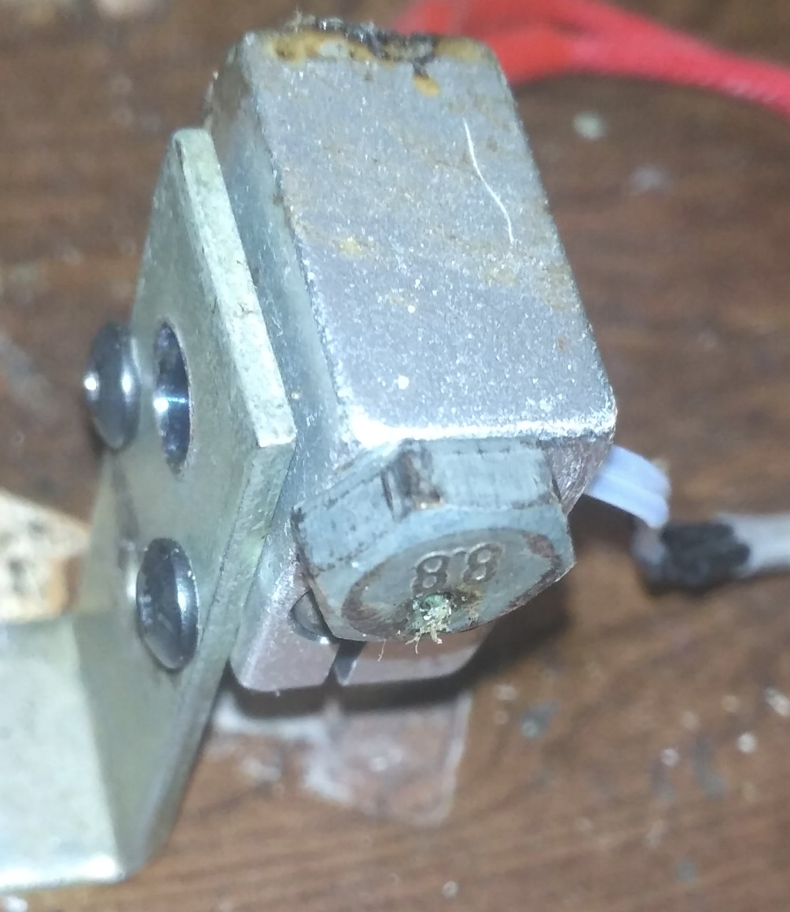

# Экструдер

## Сопло экструдера.

В моем случае было использовано сопло изготовленное из болта с диаметром резьбовой части - 5 мм.

Он был обрезан до общей длины ~10мм. Затем в центре было просверлено отверстие диаметром 2мм. Такой диаметр слишком большой для производства филамента, поэтому для его уменьшения был использован шарик от шарикоподшипника.  Несколько ударов молотка по шарику установленному на выходном отверстии экструдера - и его диаметр сужается до необходимых 1,7мм. 

У меня также был опыт использования в качестве экструдера штатных сопел устанавливаемых в принтер Anet A6. Но после нескольких неудачных попыток протяжки филамента - я отложил их до лучших времен. 
03,12,2019 - UPD 
Вполне неплохо показали себя рассверленые родные длииинные сопла для нагревателя вулкан.  
22,12,2019 - UPD

Сейчас делаю так. Беру болт М6 с длиной резьбовой части 10мм(накручиваем 2 гайки и отрезаем ножовкой). Затем подбираю сверло по фактическому диаметру 1,7мм и просверливаю болт насквозь. Затем раздаю перьевыми сверлами по кафелю. 

## Нагреватель

Изготавливается путем высверливания конического отверстия в блоке Volcano

с помощью перьевого сверла по кафелю, диаметром 8мм.

Высверливание продолжается до тех пор пока кончик сверла не коснется латунной поверхности сопла. Контроль ведется визуально. 
Для крепления блока нагревателя к рабочему столу станка - используется обычный металлический строительный уголок. В нем просверливаются пару отверстий под штатные винты, зажимающие керамический ТЭН. 

Никакой теплоизоляции не используется. PID регулятор контроллера держит температуру в заданных пределах очень точно, компенсируя теплопотери. Ниже посекундный график, показывающий дрейф температуры в пределах нескольких разрядов АЦП на протяжении часа реальной работы станка. 

вот так выглядит общая работа ПИД регулятора. 

