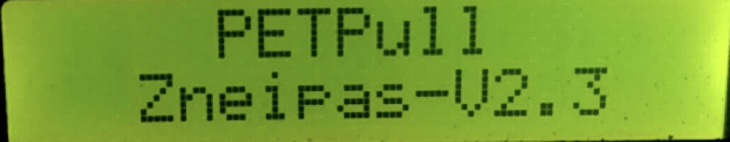
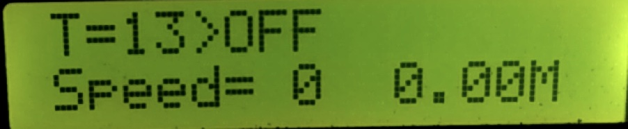
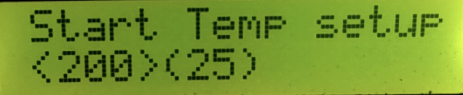
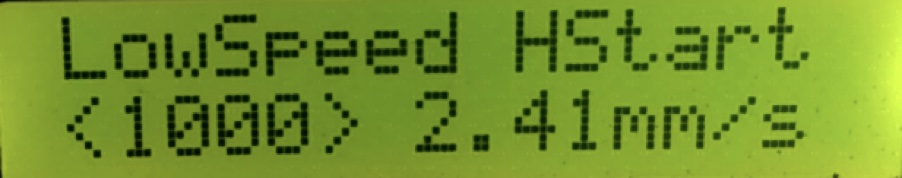
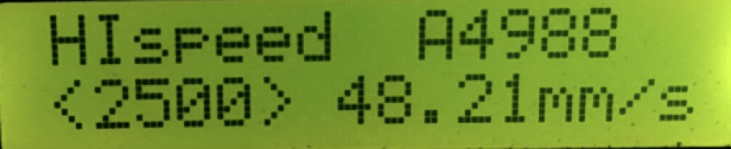

# Меню контроллера (версия 2.3)

На единой плате объединены два независимых устройства - станок по вытяжке прутка из бутылок и спайщик отрезков производимого прутка. Меню контроллера также поделено на два направления. При движении по пунктам меню вверх - управляем настройками спайщика.  При движении по пунктам меню вниз - управляем настройкой вытяжки прутка. 
Для перемещения по пунктам меню используются кнопки вверх и вниз.
Для изменения режимов используются кнопки влево и вправо. 
В нескольких пунктах меню также задействована средняя кнопка. Она позволяет выбрать дополнительные настройки. 
При первоначальном запуске контроллер несколько секунд отображает версию прошивки.

Затем по умолчанию отображается режим вытяжки прутка.

## Режим вытяжки прутка (стартовое меню).

```
T=13 > OFF
```
текущая температура нагревателя вытяжки прутка(13 градусов). Нагрев выключен(OFF). Для того чтобы включить нагрев - нужно однократно нажать среднюю кнопку клавиатуры. Первая строка сменится на примерно такую:
```
T=13 >200>200C *
```
- где текущая температура(13 градусов) стремится(>) к стартовой (200 градусов), а после некоторой работы станка 

на стартовой температуре, нагрев установится (>) в рабочую температуру(в данном случае тоже 200 градусов).  Чем отличаются данные температуры - покажу чуть позже.

## Настройка скорости вытяжки прутка. 
На второй строчке экрана можно видеть текущую скорость протяжки. При нажатии  вправо - станок начнет вытяжку прутка на первой скорости. 
```
SPEED= 1
```
При повторном нажатии кнопки вправо - станок увеличит скорость протяжки вдвое.
```
SPEED= 2
```
При следующем нажатии - втрое.
```
SPEED= 3
```
То есть базовая скорость - первая, повторные нажатия просто кратно увеличивают ее.  
Если еще раз нажать кнопку вправо -  станок переключится в режим перемотки готового прутка и увеличит скорость движения бобины ~ в 20 раз.
```
SPEED= 4
```
Данный режим нужен именно для смотки с бобины уже готового прутка. 

Кнопка влево переключает скорости взад, заставляя бобину сначала замедляться а потом начинать движение в обратную сторону.  

И базовая скорость протяжки и скорость смотки регулируются в настройках. Чуть позже рассмотрим процесс регулировки. 

## Подсчет метража вытянутого прутка. 
```
0.01M
```
Станок при движении на скоростях с 1 по 3ю подсчитывает приблизительный метраж производимого прутка. При движении на скоростях от -4 до 0 - подсчет метров не производится. Следует учитывать что поправки на диаметр намотки нет и фактическая длина прутка будет несколько больше отображаемой. Это не так страшно как может показаться на первый взгляд. Печатаем мы уже спаянными отрезками филамента и требуемый объем пластика определяется на глазок.

Для того чтобы обнулить счетчик метров между протяжками нужно дважды нажать на среднюю кнопку клавиатуры. При этом выключится и снова включится нагрев. Одновременно счетчик метража обнулится.

```
*
```
- индикация работы ПИД регулятора нагревателя вытяжки. 

В правом верхнем углу экрана можно видеть символ звездочки.  По нему визуально можно контролировать работу ПИД регулятора протяжки. В момент подачи напряжения на нагреватель - звездочка загорается. В момент отключения нагрева - гаснет. Функция из разряда удобств. Полезности особой не несет.  

## Меню настройки температуры вытяжки ленты.


Данное меню  позволяет настроить температуру вытяжки прутка.  Расположено сразу после стартового, при нажатии кнопки вниз, для быстрой настройки в процессе работы. 
Кнопками влево/вправо можно задавать температуру переработки. Она может принимать значения в диапазоне от 1 до 320 градусов. В скобках показывается текущая температура. 
По умолчанию  выставлена температура 180 градусов. Она не дает сильного запаха при переработке, источником которого выступает как сам пластик, так и остатки клея на разрезаемых бутылках. Сейчас все чаще использую температуру в 200 градусов. Станку проще тянуть ленту и шаговик не срывается.  

## Меню настройки стартовой температуры.



Лента проще сворачивается в пруток при большей температуре, тянуть ее можно при этом с меньшим усилием. Для того чтобы дать возможность станку сделать хотя бы один виток прутка на бобину с меньшей нагрузкой было дополнено меню стартовой температуры.  Данная температура регулируется кнопками влево/вправо. В скобках отображается текущая. Будет действовать при старте станка на первых 25 сантиметрах прутка. После этого контроллер переключится на удержание температуры установленной в Меню 2. Стартовая и целевая температуры независимы друг от друга и могут принимать значения в диапазоне от 1 до 320 градусов. 

## Меню настройки скорости вытяжки прутка. 


Меню скорости, с которой будет вытягиваться пруток.  По умолчанию выставлена 1000 тактовых импульсов в секунду, что соответствует скорости 2,41 мм/сек.  Изменять ее можно кнопками влево/вправо при этом отображаемая скорость протяжки прутка также будет меняться. 
В прошивке реализованы два типа работы шагового двигателя:

**SoftStart** - режим плавного разгона и торможения.

**HardStart** - режим моментального разгона и торможения.

Переключиться между ними можно нажатием средней кнопки клавиатуры. 
Лично мне привычнее и удобнее режим HardStart. Он чётче определяется на слух. Но может кому - то удобнее будет плавное управление скоростью.



