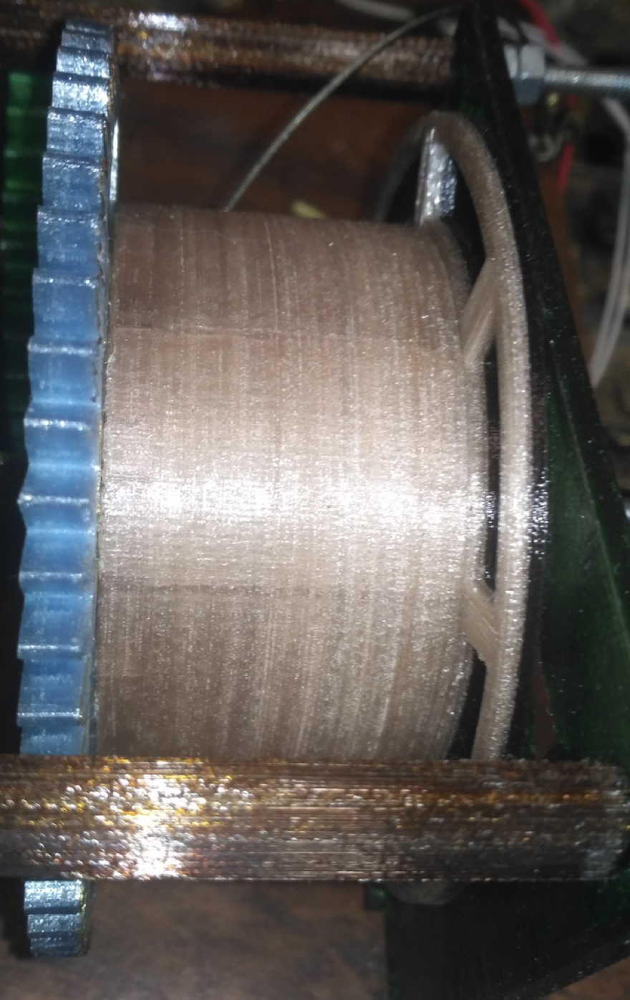

## Бобина для намотки филамента

Эта деталь состоит из трех составных частей.  
Шестерня - передает крутящий момент на тело бобины. 
Ее зубья испытывают максимальные усилия при протяжке прутка. 
Ее желательно изготавливать из износостойкого пластика типа PET, PETG или нейлона. 
В результате протяжки сотни метров прутка одна (рабочая) плоскость зубьев шестерни из ABS примялась, 
но можно с уверенностью сказать, что полкилометра - километр она протянула бы. 
Шестерня из PET при том же пробеге не имеет видимых деформаций. 
Тело бобины - деталь на которую наматывается пруток. Общая нагрузка - средняя. 
Можно печатать из любого типа пластика. 
Крышка бобины - деталь испытывающая нагрузки только когда к ней подходит навиваемый пруток. 
Очередной виток пытается втиснуться между предыдущим и крышкой бобины. Тем самым пытается оторвать крышку от тела бобины. 
Этому должны помешать восемь маленьких саморезов которыми крепится крышка к телу бобины. 
В первом прототипе было всего два самореза и их вырвало без особого труда.  
С восемью саморезами проблем не возникало. Печатать крышку можно любым типом пластика. 
